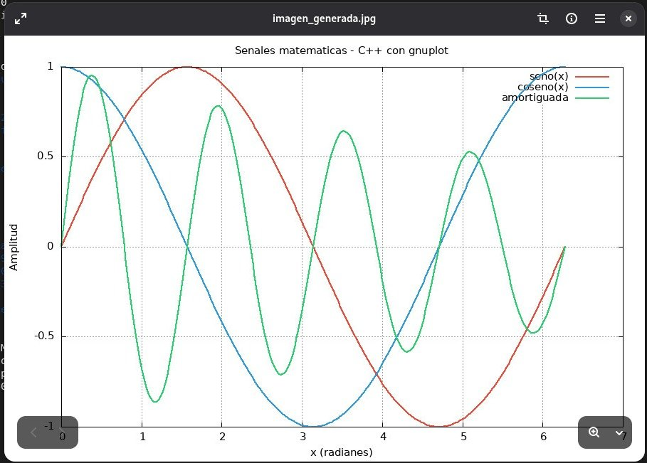
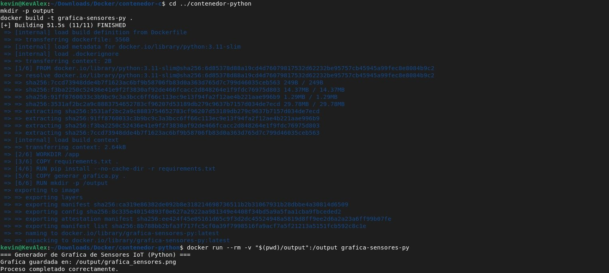
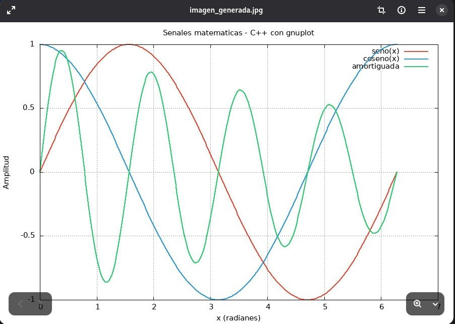

# Proyecto Docker – Embedded IoT

> **Materia:** Embedded Systems & IoT  
> **Objetivo:** Crear y documentar contenedores Docker capaces de ejecutar programas que generen imágenes, siguiendo un flujo de compilación y ejecución automatizada mediante `Makefile`.

---

## Tabla de Contenidos

1. [¿Qué es Docker?](#qué-es-docker)
2. [Conceptos clave](#conceptos-clave)
3. [Estructura del Repositorio](#estructura-del-repositorio)
4. [Contenedor 1 – C++ + gnuplot → JPG](#contenedor-1--c--gnuplot--jpg)
5. [Contenedor 2 – Python + matplotlib → PNG](#contenedor-2--python--matplotlib--png)
6. [Comandos Docker de Referencia](#comandos-docker-de-referencia)
7. [Evidencia de Ejecución](#evidencia-de-ejecución)

---

## ¿Qué es Docker?

Docker es una plataforma que permite empaquetar aplicaciones junto con sus dependencias, librerías, configuraciones y entorno de ejecución dentro de unidades portables conocidas como **contenedores**.

A diferencia de una máquina virtual tradicional, un contenedor **no requiere incluir un sistema operativo completo**: comparte el kernel del sistema anfitrión y aísla procesos, red, almacenamiento y configuración. Esto hace que los contenedores sean:

- Más rápidos de crear e iniciar.
- Más ligeros en consumo de recursos.
- Más fáciles de trasladar entre entornos.
- Más consistentes a lo largo del ciclo de desarrollo, pruebas y producción.

### Arquitectura Docker

```
┌─────────────────────────────────────────────────────────┐
│                        HOST OS                          │
│                                                         │
│   ┌──────────────┐        ┌─────────────────────────┐  │
│   │ Docker Client│        │      Contenedor          │  │
│   │   (docker)   │◄──────►│  ┌─────────────────┐    │  │
│   └──────────────┘        │  │  Tu Aplicación  │    │  │
│                           │  ├─────────────────┤    │  │
│   ┌──────────────┐        │  │  Dependencias   │    │  │
│   │ Docker Daemon│◄──────►│  ├─────────────────┤    │  │
│   │  (dockerd)   │        │  │  Sistema base   │    │  │
│   └──────────────┘        │  └─────────────────┘    │  │
│                           └─────────────────────────┘  │
└─────────────────────────────────────────────────────────┘
```

---

## Conceptos clave

| Concepto | Descripción |
|---|---|
| **Imagen** | Plantilla inmutable con todo lo necesario para ejecutar la aplicación. |
| **Contenedor** | Instancia en ejecución de una imagen. Puede iniciarse, detenerse y recrearse. |
| **Dockerfile** | Archivo de texto con instrucciones para construir una imagen paso a paso. |
| **Volumen** | Mecanismo para persistir datos fuera del ciclo de vida del contenedor. |
| **Red Docker** | Permite la comunicación entre contenedores de forma aislada. |

### Flujo básico de trabajo

```
1. Escribir Dockerfile
       │
       ▼
2. docker build  →  Imagen lista
       │
       ▼
3. docker run    →  Contenedor en ejecución
       │
       ▼
4. Verificar logs / resultado
       │
       ▼
5. Repetir al cambiar código
```

---

## Estructura del Repositorio

```
docker-tarea/
├── README.md                          ← Documentación principal
├── .gitignore                         ← Exclusiones de Git
│
├── contenedor-c/                      ← Contenedor 1: C++ + gnuplot → JPG
│   ├── Dockerfile
│   ├── Makefile
│   └── main.cpp
│
├── contenedor-python/                 ← Contenedor 2: Python → PNG
│   ├── Dockerfile
│   ├── requirements.txt
│   └── generar_grafica.py
│
└── docs/
    └── screenshots/                   ← Evidencia de ejecución real
        ├── 01_build_cpp.png
        ├── 02_imagen_generada_jpg.png
        ├── 03_build_python.png
        ├── 04_run_python_docker_images.png
        ├── 05_grafica_sensores_png.png
        └── 06_imagen_generada_jpg2.png
```

---

## Contenedor 1 – C++ + gnuplot → JPG

### Descripción

Un programa en **C++** compilado con `g++` genera un archivo de datos `.dat` con señales matemáticas (senoidal, cosenoidal y señal amortiguada), crea un script para **gnuplot** y lo ejecuta para producir la imagen JPG final.

Las herramientas instaladas en el contenedor son:

- `build-essential`
- `g++`
- `gnuplot`
- `xdg-utils`
- `libx11-dev`

### Flujo interno

```
[main.cpp]
    │
    ▼  (g++ compila via Makefile)
[generar_imagen]
    │
    ├──► escribe /output/datos.dat   (360 puntos: x, seno, coseno, amortiguada)
    │
    ├──► escribe /output/plot.gp     (script gnuplot)
    │
    └──► llama gnuplot plot.gp
              │
              ▼
         /output/imagen_generada.jpg  ✓
```

### Dockerfile

```dockerfile
FROM ubuntu:22.04
ENV DEBIAN_FRONTEND=noninteractive
RUN apt-get -o Acquire::Check-Valid-Until=false \
            -o Acquire::Check-Date=false \
            update && apt-get install -y \
        build-essential \
        g++ \
        gnuplot \
        xdg-utils \
        libx11-dev \
    && rm -rf /var/lib/apt/lists/*
WORKDIR /usr/src/app
COPY main.cpp Makefile ./
RUN mkdir -p /output
ARG MAKE_TARGET=all
ENV TARGET=${MAKE_TARGET}
CMD make ${TARGET}
```

### Makefile

```makefile
CXX      = g++
CXXFLAGS = -Wall -O2 -std=c++17
TARGET   = generar_imagen
all: $(TARGET) run
$(TARGET): main.cpp
	$(CXX) $(CXXFLAGS) main.cpp -o $(TARGET) -lm
run: $(TARGET)
	./$(TARGET)
clean:
	rm -f $(TARGET)
```

### Cómo construir y ejecutar

```bash
cd contenedor-c
# Construir la imagen
docker build -t imagen-jpg-cpp .
# Ejecutar y recuperar el JPG en una carpeta local
mkdir -p output
docker run --rm -v "$(pwd)/output":/output imagen-jpg-cpp
# Ver los archivos generados
ls -lh output/
# imagen_generada.jpg   datos.dat   plot.gp
```

---

## Contenedor 2 – Python + matplotlib → PNG

### Descripción

Contenedor adicional propuesto. Un programa en **Python 3** simula lecturas de tres sensores IoT a lo largo de 24 horas y genera una gráfica en formato **PNG** utilizando `matplotlib` y `numpy`.

| Sensor | Unidad | Comportamiento simulado |
|---|---|---|
| Temperatura | °C | Curva senoidal con mínimo nocturno y máximo diurno |
| Humedad relativa | % | Inversa a la temperatura |
| Luminosidad | lux | Cero durante la noche, campana de 6:00 a 18:00 h |

### Dockerfile

```dockerfile
FROM python:3.11-slim
WORKDIR /app
COPY requirements.txt .
RUN pip install --no-cache-dir -r requirements.txt
COPY generar_grafica.py .
RUN mkdir -p /output
CMD ["python3", "generar_grafica.py"]
```

### Cómo construir y ejecutar

```bash
cd contenedor-python
docker build -t grafica-sensores-py .
mkdir -p output
docker run --rm -v "$(pwd)/output":/output grafica-sensores-py
# Resultado: output/grafica_sensores.png
```

### Comparativa entre contenedores

| Aspecto | Contenedor 1 (C++) | Contenedor 2 (Python) |
|---|---|---|
| Lenguaje | C++ (g++) | Python 3.11 |
| Imagen base | ubuntu:22.04 | python:3.11-slim |
| Motor gráfico | gnuplot | matplotlib |
| Formato salida | JPG | PNG |
| Build tool | Makefile | — |
| Caso de uso IoT | Entorno de compilación embebido | Análisis y dashboard de datos |

---

## Comandos Docker de Referencia

```bash
# Ver imágenes disponibles localmente
docker images
# Ver contenedores en ejecución
docker ps
# Ver todos los contenedores (incluidos los detenidos)
docker ps -a
# Eliminar una imagen
docker rmi nombre-imagen
# Eliminar contenedores detenidos
docker container prune
# Abrir terminal dentro de un contenedor
docker exec -it nombre-contenedor /bin/bash
# Ver logs de un contenedor
docker logs nombre-contenedor
# Inspeccionar una imagen
docker inspect nombre-imagen
```

---

## Evidencia de Ejecución

### 1. Build del Contenedor C++ (`imagen-jpg-cpp`)

Construcción exitosa de la imagen en 150.2 s. Se instalaron `build-essential`, `g++`, `gnuplot`, `xdg-utils` y `libx11-dev` sobre `ubuntu:22.04`. El programa compiló y generó la imagen correctamente.


---

### 2. Imagen JPG generada por el Contenedor C++

La gráfica muestra tres señales matemáticas generadas en C++ y renderizadas con gnuplot: `seno(x)` en rojo, `coseno(x)` en azul y la señal `amortiguada` en verde.



---

### 3. Build del Contenedor Python (`grafica-sensores-py`)

Construcción exitosa en 51.5 s a partir de `python:3.11-slim`. Se instalaron `matplotlib` y `numpy` vía pip. El script ejecutó sin errores y generó el archivo PNG correspondiente.



---

### 4. Ejecución y listado de imágenes Docker

Se pueden apreciar ambas imágenes construidas (`imagen-jpg-cpp:latest` y `grafica-sensores-py:latest`), junto con los archivos generados en las carpetas de salida de cada contenedor.


---

### 5. Gráfica PNG generada por el Contenedor Python

Dashboard de sensores IoT con datos simulados de 24 horas: temperatura (rojo), humedad (turquesa) y luminosidad (amarillo), incluyendo una línea de promedio por cada sensor.


---

### 6. Imagen JPG – Vista completa

Vista completa de la imagen JPG producida por el contenedor C++ con gnuplot.



---

## Notas y buenas prácticas

- Se usa `--rm` en `docker run` para eliminar el contenedor automáticamente al finalizar.
- Los archivos generados se recuperan mediante **volúmenes** (`-v`) para evitar que queden atrapados dentro del contenedor.
- El `.gitignore` excluye los archivos generados (`.jpg`, `.png`, `.dat`) para no subir binarios al repositorio.
- Cada Dockerfile limpia los cachés de paquetes para mantener imágenes lo más ligeras posible.
- El `ARG MAKE_TARGET` permite cambiar el objetivo de `make` al construir la imagen sin necesidad de modificar el Dockerfile.
