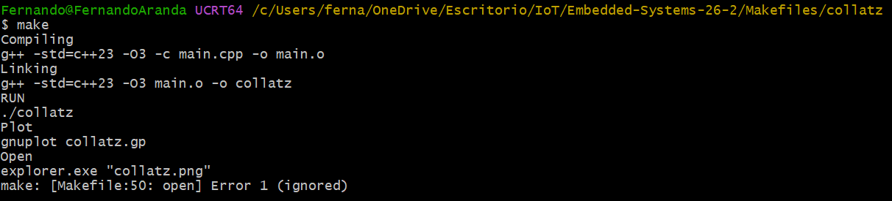
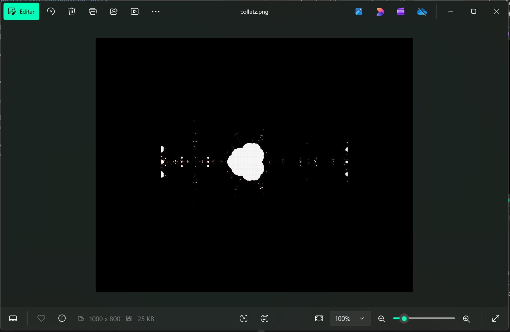

# Uso y documentación de Makefiles

## Descripción

En el desarrollo de este ejercicio se explica la estructura y el uso de los archivos `Makefile` para la estandarización de **procesos de compilación y ejecución**. Asimismo, se describe y documenta su funcionamiento mediante dos ejemplos prácticos.

---

## Objetivos

- Identificar y comprender la estructura básica de un `Makefile` y su función en la automatización de proyectos.
- Explicar cómo un `Makefile` contribuye a estandarizar los procesos de compilación.
- Crear un `Makefile` propio, documentarlo y organizarlo en un repositorio personal.
- Describir el funcionamiento del código del `Makefile`, reportar los resultados de ejecución y explicar cómo se logra la automatización.

---

## 1. Ejemplo de prueba

Como primer paso, se realiza la prueba con el archivo Make incluido en la carpeta `jilia` del repositorio proporcionado en las especificaciones de este ejercicio.

El código del archivo `main.cpp` es el siguiente:

```cpp
#include <cmath>
#include <complex>
#include <iomanip>
#include <iostream>
#include <fstream>

double mandelbrot (const double& real, const double& imag) {
  
  // (-0.70176) (-0.3842)
  // (-0.835)  (-0.2321)
  // (0.4)  (-0.325)
  double z_real = real;
  double z_imag = imag;

  int iter = 45;
  double max_iter = static_cast<double>(iter);

  double zn_real; double zn_imag;
  for (int n = 0; n < iter; n++) {

    zn_real = (z_real * z_real) - (z_imag * z_imag) + (-0.70176);
    zn_imag = 2.0 * z_real * z_imag + (-0.3842);

    if ( zn_real*zn_real + zn_imag*zn_imag > 4.0 ) {
      return static_cast<double>(n);
    }

    z_real = zn_real;
    z_imag = zn_imag;

  }

  return max_iter;
}

int main(int argc, char** argv) {
  double x0 = -0.0;
  double r = 1.8;
  double points = 500;

  std::string filename = "julia_set.txt";
  std::ofstream outfile;
  outfile.open(filename);

  // Set fixed-point notation and precision
  outfile << std::fixed << std::setprecision(5);

  for (double y = -r; y < r; y += (r+r)/(points-1.0)) {
    for (double x = x0-r; x < x0+r; x += (r+r)/(points-1.0)) {
      outfile << std::setw(8) << x << ", " 
              << std::setw(8) << y << ", " 
              << std::setw(8) <<  mandelbrot(x,y) <<
              std::endl;

    }
    outfile << std::endl;
  }

  outfile.close();

  return 0;
}
```

Este programa en `C++` genera los datos necesarios para visualizar un `conjunto de Julia`, una estructura matemática asociada a los fractales. Define una función que, para cada punto del plano complejo (x, y), aplica iterativamente una fórmula cuadrática y mide cuántas iteraciones tarda en "escapar" (es decir, cuando su magnitud supera un límite determinado). En el `main`, recorre una malla de puntos dentro de un rango definido, evalúa cada uno con esa función y guarda los resultados en el archivo de texto `julia_set.txt` con formato ordenado, el cual se emplea para dibujar la gráfica generada en el archivo `julia_set.png`.

Por su parte, el código del `Makefile` presenta la siguiente estructura:

```make
# Variables 
CXX = g++
CXXFLAGS = -std=c++23 -O3

GP = julia_set.gp 
TXT = $(GP:.gp=.txt)
PNG = $(GP:.gp=.png)

SRCS = main.cpp

OBJS = $(SRCS:.cpp=.o)

APP  = julia

## TARGETS

all: run plot open 

.PHONY: vars
vars:
	@echo "print variables"
	@echo "SRCS = $(SRCS)"
	@echo "OBJS = $(OBJS)"
	@echo "PRE  = $<"
	@echo "NAME = $@"
	@echo "GP   = $(GP)"
	@echo "TXT  = $(TXT)"

%.o: %.cpp
	@echo "Compiling"
	$(CXX) $(CXXFLAGS) -c $< -o $@

$(APP): $(OBJS)
	@echo "Linking"
	$(CXX) $(CXXFLAGS) $(OBJS) -o $(APP)

run: $(APP)
	@echo "RUN"
	./$(APP)

plot: $(TXT)
	@echo "Plot"
	gnuplot $(GP)

open:
	@echo "Open"
	xdg-open $(PNG) &

clean: 
	rm *.o $(APP) *.txt *.png
```

Este archivo cuenta con varios bloques clave. A continuación se describe cada uno.

**Variables**

```make
# Variables 
CXX = g++
CXXFLAGS = -std=c++23 -O3

GP = julia_set.gp 
TXT = $(GP:.gp=.txt)
PNG = $(GP:.gp=.png)

SRCS = main.cpp
OBJS = $(SRCS:.cpp=.o)

APP  = julia
```

Definen todos los elementos del proyecto:

- `CXX`: compilador de C++.
- `CXXFLAGS`: estándar y nivel de optimización.
- `GP`: script de graficación.
- `TXT`, `PNG`: nombres derivados automáticamente del script.
- `SRCS`, `OBJS`: archivos fuente y archivos objeto.
- `APP`: nombre del ejecutable final.

**Objetivo principal**

```make
all: run plot open 
```

Indica que al invocar `make`, se ejecutará el flujo completo:

1. Compilar y ejecutar.
2. Generar la gráfica.
3. Abrir la imagen.

**Depuración / inspección**

```make
.PHONY: vars
vars:
	@echo "print variables"
	@echo "SRCS = $(SRCS)"
	@echo "OBJS = $(OBJS)"
	@echo "PRE  = $<"
	@echo "NAME = $@"
	@echo "GP   = $(GP)"
	@echo "TXT  = $(TXT)"
```

Muestra los valores de las variables automáticas del Makefile:

- `$<`: primera dependencia del objetivo.
- `$@`: nombre del objetivo actual.

**Regla genérica de compilación**

```make
%.o: %.cpp
	@echo "Compiling"
	$(CXX) $(CXXFLAGS) -c $< -o $@
```

Convierte cualquier archivo `.cpp` en su correspondiente `.o`:

- `$<`: archivo fuente de entrada.
- `$@`: archivo objeto de salida.

**Enlazado**

```make
$(APP): $(OBJS)
	@echo "Linking"
	$(CXX) $(CXXFLAGS) $(OBJS) -o $(APP)
```

Genera el ejecutable (`julia`) a partir de los archivos objeto.

**Ejecución del programa**

```make
run: $(APP)
	@echo "RUN"
	./$(APP)
```

Verifica que el ejecutable exista y, una vez confirmado, lo lanza.

**Generación de la gráfica**

```make
plot: $(TXT)
	@echo "Plot"
	gnuplot $(GP)
```

Invoca `Gnuplot` para producir una imagen a partir del script `.gp`.

**Visualización del resultado**

```make
open:
	@echo "Open"
	cmd /c start $(PNG)
```

Abre la imagen generada con el visor predeterminado del sistema.

**Limpieza**

```make
clean: 
	rm *.o $(APP) *.txt *.png
```

Elimina todos los archivos generados durante la compilación y ejecución, permitiendo recompilar el proyecto desde cero.

---

### Funcionamiento

> **Importante:** se está utilizando la terminal `MYSYS2 UCRT64` desde Windows.

#### 1.1 Acceder desde la terminal al directorio en el que se encuentra el archivo `make` con el que se trabajará.


Dentro de esta carpeta se encuentran el Makefile y el archivo `main.cpp`, los cuales se compilarán y ejecutarán a continuación.

#### 1.2 Compilación y ejecución del archivo main.cpp a partir del archivo Makefile

Ejecutar el siguiente comando desde la terminal:

```bash
make
```

Una vez ejecutado el comando, la terminal desplegará el siguiente mensaje:


Esto confirma que el archivo `main.cpp` fue compilado y ejecutado exitosamente, generándose los archivos `main.o`, `julia.exe`, `julia_set.txt` y `julia_set.png`.

#### 1.3 Gráfica del conjunto de Julia

La ejecución del programa abre el archivo `julia_set.png`, que contiene la gráfica del conjunto de Julia generada a partir de los valores almacenados en `julia_set.txt`.


De esta manera queda demostrado el funcionamiento de un archivo `make` utilizado para compilar y ejecutar un programa en `C++`.

---

## 2. Ejemplo propuesto

Una vez descrito y analizado el programa anterior, se presenta una propuesta de ejercicio adicional. En este caso se utilizará un archivo `make` para compilar y ejecutar un programa escrito en `C++` que calcula la `conjetura de Collatz` y genera una visualización de tipo fractal mediante `gnuplot`.

El código del programa `main.cpp` es el siguiente:

```cpp
#include <complex>
#include <fstream>
#include <iomanip>
#include <iostream>
#include <numbers>

using namespace std;

complex<double> collatz_complex(complex<double> z) {
    return (z / 2.0) * (1.0 + cos(std::numbers::pi * z)) / 2.0 +
           (3.0 * z + complex<double>(1.0, 0.0)) * (1.0 - cos(std::numbers::pi * z)) / 2.0;
}

// Iteraciones hasta escape
int collatz_fractal(complex<double> z0) {
    complex<double> z = z0;
    int max_iter = 500;

    for (int i = 0; i < max_iter; i++) {
        z = collatz_complex(z);

        if (abs(z) > 60.0) {
            return i;
        }
    }
    return max_iter;
}

int main() {
    int width = 800;
    int height = 800;

    double xmin = -2.0, xmax = 2.0;
    double ymin = -2.0, ymax = 2.0;

    ofstream file("collatz.txt");
    file << fixed << setprecision(6);

    for (int j = 0; j < height; j++) {
        for (int i = 0; i < width; i++) {

            double x = xmin + (xmax - xmin) * i / (width - 1);
            double y = ymin + (ymax - ymin) * j / (height - 1);

            complex<double> z(x, y);
            int value = collatz_fractal(z);

            file << x << " " << y << " " << value << "\n";
        }
        file << "\n";
    }

    file.close();
    return 0;
}
```

Este programa genera los datos necesarios para visualizar un fractal basado en una extensión de la `conjetura de Collatz` al plano complejo. Define una función que combina de forma continua los comportamientos de la regla de Collatz (dividir entre 2, o multiplicar por 3 y sumar 1) mediante el uso del coseno con el valor de π, lo que permite operar con números complejos. Para cada punto de una malla bidimensional dentro del rango [−2, 2] en ambos ejes, itera esta función hasta alcanzar el número máximo de repeticiones o hasta que el valor diverge (supera cierta magnitud). El número de iteraciones necesarias para escapar se registra junto con las coordenadas del punto en el archivo `collatz.txt`, el cual se emplea posteriormente para graficar el fractal en la imagen `collatz.png`.

El archivo `Makefile` utilizado para la compilación y ejecución del programa es el siguiente:

```make
# Variables 
CXX = g++
CXXFLAGS = -std=c++23 -O3

GP = collatz.gp 
TXT = $(GP:.gp=.txt)
PNG = $(GP:.gp=.png)

SRCS = main.cpp
OBJS = $(SRCS:.cpp=.o)

APP  = collatz

## TARGETS

all: run plot open 

.PHONY: vars
vars:
	@echo "print variables"
	@echo "SRCS = $(SRCS)"
	@echo "OBJS = $(OBJS)"
	@echo "PRE  = $<"
	@echo "NAME = $@"
	@echo "GP   = $(GP)"
	@echo "TXT  = $(TXT)"

%.o: %.cpp
	@echo "Compiling"
	$(CXX) $(CXXFLAGS) -c $< -o $@

$(APP): $(OBJS)
	@echo "Linking"
	$(CXX) $(CXXFLAGS) $(OBJS) -o $(APP)

$(TXT): $(APP)
	@echo "Generating data"
	./$(APP)

run: $(APP)
	@echo "RUN"
	./$(APP)

plot: $(TXT)
	@echo "Plot"
	gnuplot $(GP)

open:
	@echo "Open"
	-explorer.exe "$(shell cygpath -w $(PNG))"

clean: 
	rm *.o $(APP) *.txt *.png
```

**Variables**

```make
CXX = g++
CXXFLAGS = -std=c++23 -O3

GP = collatz.gp 
TXT = $(GP:.gp=.txt)
PNG = $(GP:.gp=.png)

SRCS = main.cpp
OBJS = $(SRCS:.cpp=.o)

APP  = collatz
```

- Define el compilador y las banderas de compilación.
- Emplea sustituciones automáticas para derivar los nombres de los archivos `.txt`, `.png` y `.o`.
- Centraliza los nombres de archivos en un solo lugar.

**Objetivo principal**

```make
all: run plot open 
```

Es el objetivo por defecto (invocado con `make`). Ejecuta el flujo completo:

1. Correr el programa.
2. Graficar los datos.
3. Abrir la imagen resultante.

**Depuración / inspección**

```make
.PHONY: vars
vars:
	@echo "print variables"
	@echo "SRCS = $(SRCS)"
	@echo "OBJS = $(OBJS)"
	@echo "PRE  = $<"
	@echo "NAME = $@"
	@echo "GP   = $(GP)"
	@echo "TXT  = $(TXT)"
```

Muestra los valores de las variables automáticas `$<` y `$@` para facilitar la depuración.

**Regla genérica de compilación**

```make
%.o: %.cpp
	@echo "Compiling"
	$(CXX) $(CXXFLAGS) -c $< -o $@
```

Regla patrón para compilar cualquier `.cpp` y producir su correspondiente `.o`:

- `$<`: archivo fuente.
- `$@`: archivo objeto destino.

**Enlazado**

```make
$(APP): $(OBJS)
	@echo "Linking"
	$(CXX) $(CXXFLAGS) $(OBJS) -o $(APP)
```

Une los archivos `.o` para generar el ejecutable final. Representa el último paso del proceso de compilación.

**Generación de datos**

```make
$(TXT): $(APP)
	@echo "Generating data"
	./$(APP)
```

Genera el archivo `.txt` al ejecutar el programa y define la dependencia clave: `datos ← ejecutable`.

**Ejecución del programa**

```make
run: $(APP)
	@echo "RUN"
	./$(APP)
```

Permite lanzar el programa de forma manual desde la terminal.

**Generación del gráfico**

```make
plot: $(TXT)
	@echo "Plot"
	gnuplot $(GP)
```

Invoca Gnuplot para generar la imagen a partir del archivo de datos. Este paso requiere que el `.txt` exista previamente.

**Visualización del resultado**

```make
open:
	@echo "Open"
	-explorer.exe "$(shell cygpath -w $(PNG))"
```

Abre la imagen generada con el explorador de archivos de Windows.

**Limpieza**

```make
clean: 
	rm *.o $(APP) *.txt *.png
```

Elimina todos los archivos generados y deja el directorio listo para una compilación limpia desde cero.

---

### Funcionamiento

#### 2.1 Acceder desde la terminal al directorio en el que se encuentra el archivo `make`.


Dentro de esta carpeta se encuentran el Makefile y el archivo `main.cpp`.

#### 2.2 Compilación y ejecución del archivo main.cpp a partir del archivo Makefile

Ejecutar el siguiente comando desde la terminal:

```bash
make
```

Una vez ejecutado el comando, la terminal desplegará lo siguiente:



Esto confirma que la compilación y ejecución de `main.cpp` fueron exitosas, generándose los archivos `main.o`, `collatz.exe`, `collatz.txt` y `collatz.png`.

#### 2.3 Gráfica de la conjetura de Collatz

La ejecución abre el archivo `collatz.png`, que contiene el gráfico del fractal de Collatz generado a partir de los valores almacenados en `collatz.txt`.


