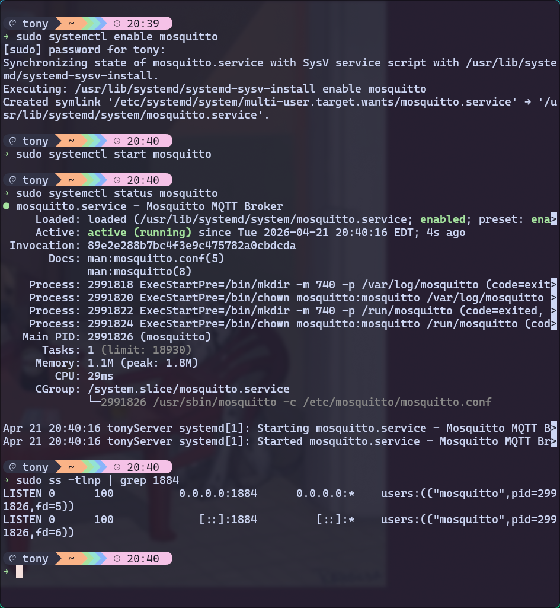
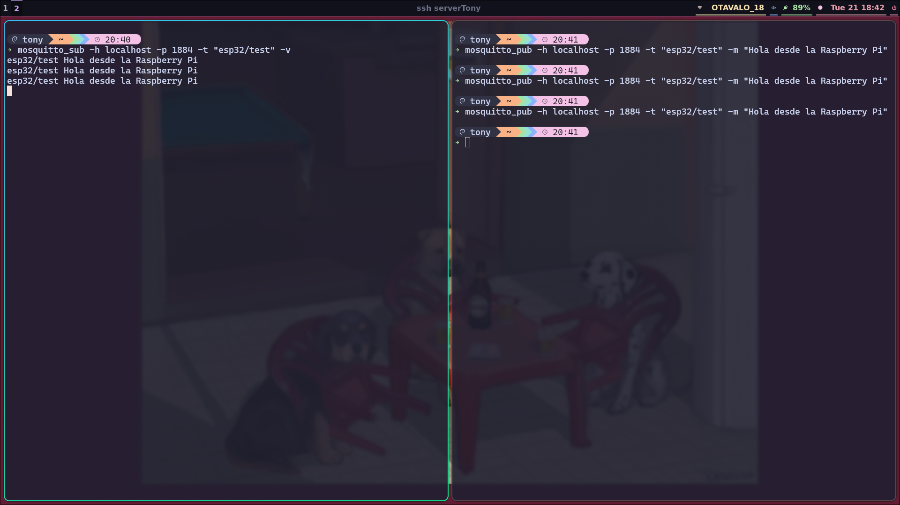

# 🛰️ Tarea: Instalación y Configuración de Mosquitto MQTT en Raspberry Pi con Publisher ESP32

## Descripción

Instalación y configuración de  **Mosquitto MQTT** directamente en una Raspberry Pi. Programación de una **ESP32** como Publisher que enviará mensajes periódicos al broker.

> ⚠️ **Nota importante:** Esta Raspberry Pi ya tiene una instancia de Mosquitto corriendo en un contenedor Docker en el puerto **1883**. La instalación bare-metal de este ejercicio usará el puerto **1884** para evitar conflictos.

---

## Objetivos de Aprendizaje

- Comprender el protocolo MQTT y su aplicación en IoT.
- Instalar y configurar Mosquitto MQTT de forma nativa (bare-metal) en Raspberry Pi.
- Programar un Publisher en ESP32 para enviar mensajes al broker.
- Documentar el proceso en un repositorio Git con buenas prácticas.
- Demostrar la integración entre dispositivos embebidos y servidores IoT.

---

## Requisitos Previos

| Componente | Detalle |
|---|---|
| Hardware | Raspberry Pi (cualquier modelo con Raspbian/Raspberry Pi OS) |
| Hardware | ESP32 (cualquier variante) |
| Software Pi | Raspberry Pi OS actualizado |
| Software PC | Arduino IDE |
| Red | ESP32 y Raspberry Pi en la **misma red local** |

---

## Parte 1: Instalación Bare-Metal de Mosquitto en Raspberry Pi

### 1.1 Actualizar el sistema

Antes de instalar cualquier paquete, actualiza los repositorios y el sistema operativo:

```bash
sudo apt update && sudo apt upgrade -y
```

### 1.2 Instalar Mosquitto y sus herramientas

```bash
sudo apt install -y mosquitto mosquitto-clients
```

Verifica que la instalación fue exitosa:

```bash
mosquitto --version
```

### 1.3 Configurar Mosquitto para usar el puerto 1884

Dado que el puerto **1883** ya está en uso por el contenedor Docker, crearemos un archivo de configuración personalizado para la instancia bare-metal:

```bash
sudo nano /etc/mosquitto/conf.d/custom.conf
```

Agrega el siguiente contenido:

```conf
# Puerto alternativo para evitar conflicto con Docker (puerto 1883)
listener 1884

# Permitir conexiones sin autenticación (solo para desarrollo/pruebas)
allow_anonymous true

# Archivo de log
log_dest file /var/log/mosquitto/mosquitto.log
log_type all
```

Guarda el archivo con `Ctrl+O`, luego `Enter`, y sal con `Ctrl+X`.

### 1.4 Habilitar y arrancar Mosquitto como servicio

```bash
# Habilitar el servicio para que inicie automáticamente al encender la Pi
sudo systemctl enable mosquitto

# Iniciar el servicio ahora
sudo systemctl start mosquitto

# Verificar que está corriendo correctamente
sudo systemctl status mosquitto
```

La salida debería mostrar `Active: active (running)`.

### 1.5 Verificar que escucha en el puerto 1884

```bash
sudo ss -tlnp | grep 1884
```

Deberías ver una línea con `mosquitto` escuchando en el puerto `1884`.

---

## Parte 2: Prueba Básica del Broker

Abre **dos terminales** en la Raspberry Pi (o dos sesiones SSH).

### 2.1 Terminal 1 — Iniciar un Subscriber

Suscríbete al tópico `esp32/test` especificando el puerto 1884:

```bash
mosquitto_sub -h localhost -p 1884 -t "esp32/test" -v
```

Deja esta terminal abierta y en espera.

### 2.2 Terminal 2 — Publicar un mensaje de prueba

En la segunda terminal, publica un mensaje:

```bash
mosquitto_pub -h localhost -p 1884 -t "esp32/test" -m "Hola desde la Raspberry Pi"
```

### 2.3 Verificar recepción

En la **Terminal 1** deberías ver aparecer:

```
esp32/test Hola desde la Raspberry Pi
```

✅ Si ves el mensaje, el broker está funcionando correctamente en el puerto 1884.

---

## Parte 3: Configuración del Publisher en ESP32

### 3.1 Preparar el entorno de desarrollo

**Arduino IDE:**
1. Descarga e instala [Arduino IDE 2.x](https://www.arduino.cc/en/software).
2. Ve a `File > Preferences` y agrega la siguiente URL en *Additional boards manager URLs*:
   ```
   https://raw.githubusercontent.com/espressif/arduino-esp32/gh-pages/package_esp32_index.json
   ```
3. Ve a `Tools > Board > Boards Manager`, busca `esp32` e instala el paquete de **Espressif Systems**.

### 3.2 Instalar la librería PubSubClient

**En Arduino IDE:**
- Ve a `Sketch > Include Library > Manage Libraries...`
- Busca `PubSubClient` de **Nick O'Leary** e instálala.

### 3.3 Obtener la IP de la Raspberry Pi

En la Raspberry Pi ejecuta:

```bash
hostname -I
```

Anota la IP (ejemplo: `192.168.1.100`). La necesitarás en el código de la ESP32.

### 3.4 Código del Publisher para ESP32

Crea un nuevo sketch con el siguiente código. Reemplaza los valores de `WIFI_SSID`, `WIFI_PASSWORD` y `MQTT_BROKER_IP` con los tuyos:

```cpp
#include <WiFi.h>
#include <PubSubClient.h>

// ─── Configuración WiFi ───────────────────────────────────────────
const char* WIFI_SSID     = "TU_RED_WIFI";
const char* WIFI_PASSWORD = "TU_CONTRASEÑA";

// ─── Configuración MQTT ───────────────────────────────────────────
const char* MQTT_BROKER_IP = "192.168.1.100"; // IP de tu Raspberry Pi
const int   MQTT_PORT      = 1884;            // Puerto bare-metal (no Docker)
const char* MQTT_CLIENT_ID = "ESP32_Publisher";
const char* MQTT_TOPIC     = "esp32/test";

// ─── Intervalo de publicación (ms) ───────────────────────────────
const long PUBLISH_INTERVAL = 5000; // cada 5 segundos

// ─── Objetos globales ─────────────────────────────────────────────
WiFiClient   espClient;
PubSubClient mqttClient(espClient);
unsigned long lastPublishTime = 0;
int messageCount = 0;

// ─── Conexión WiFi ────────────────────────────────────────────────
void connectWiFi() {
  Serial.print("Conectando a WiFi: ");
  Serial.println(WIFI_SSID);
  WiFi.begin(WIFI_SSID, WIFI_PASSWORD);

  while (WiFi.status() != WL_CONNECTED) {
    delay(500);
    Serial.print(".");
  }

  Serial.println("\n✅ WiFi conectado!");
  Serial.print("IP de la ESP32: ");
  Serial.println(WiFi.localIP());
}

// ─── Conexión MQTT ────────────────────────────────────────────────
void connectMQTT() {
  while (!mqttClient.connected()) {
    Serial.print("Conectando al broker MQTT...");

    if (mqttClient.connect(MQTT_CLIENT_ID)) {
      Serial.println(" ✅ Conectado!");
    } else {
      Serial.print(" ❌ Error, rc=");
      Serial.print(mqttClient.state());
      Serial.println(" — reintentando en 5 segundos.");
      delay(5000);
    }
  }
}

// ─── Setup ────────────────────────────────────────────────────────
void setup() {
  Serial.begin(115200);
  delay(1000);

  connectWiFi();

  mqttClient.setServer(MQTT_BROKER_IP, MQTT_PORT);
}

// ─── Loop ─────────────────────────────────────────────────────────
void loop() {
  // Reconectar si se pierde la conexión
  if (!mqttClient.connected()) {
    connectMQTT();
  }
  mqttClient.loop();

  // Publicar mensaje cada PUBLISH_INTERVAL milisegundos
  unsigned long now = millis();
  if (now - lastPublishTime >= PUBLISH_INTERVAL) {
    lastPublishTime = now;
    messageCount++;

    // Construir payload
    String payload = "Mensaje #" + String(messageCount) +
                     " desde ESP32 | Uptime: " + String(now / 1000) + "s";

    // Publicar
    if (mqttClient.publish(MQTT_TOPIC, payload.c_str())) {
      Serial.print("📤 Publicado en [");
      Serial.print(MQTT_TOPIC);
      Serial.print("]: ");
      Serial.println(payload);
    } else {
      Serial.println("❌ Error al publicar.");
    }
  }
}
```

### 3.5 Cargar el código a la ESP32

1. Conecta la ESP32 a tu computadora por USB.
2. Selecciona la placa correcta en `Tools > Board`.
3. Selecciona el puerto COM/Serial correcto.
4. Haz clic en **Upload** (→).
5. Abre el **Monitor Serial** a `115200 baudios` para ver los logs de conexión y publicación.

---

## Parte 4: Verificar la Comunicación Completa

Con el código corriendo en la ESP32, vuelve a la Raspberry Pi y suscríbete al tópico:

```bash
mosquitto_sub -h localhost -p 1884 -t "esp32/test" -v
```

Deberías ver mensajes llegando cada 5 segundos, similares a:

```
esp32/test Mensaje #1 desde ESP32 | Uptime: 5s
esp32/test Mensaje #2 desde ESP32 | Uptime: 10s
esp32/test Mensaje #3 desde ESP32 | Uptime: 15s
```

¡La integración ESP32 → Broker MQTT → Subscriber está funcionando!

---

## Parte 5: Evidencia de Funcionamiento

### Instalación Mosquitto


---

### Test publisher


---

### Esp32 publisher


